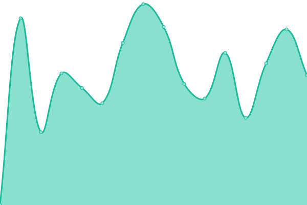

# [📈 Live Status](https://upptime.github.io/upptime): <!--live status--> **🟧 Partial outage**

This repository contains the open-source uptime monitor and status page for [Upptime](https://upptime.js.org), powered by [Upptime](https://github.com/upptime/upptime).

With [Upptime](https://upptime.js.org), you can get your own unlimited and free uptime monitor and status page, powered entirely by a GitHub repository. We use [Issues](https://github.com/upptime/upptime/issues) as incident reports, [Actions](https://github.com/rodseb/status-services/actions) as uptime monitors, and [Pages](https://upptime.github.io/upptime) for the status page.

<!--start: status pages-->
<!-- This summary is generated by Upptime (https://github.com/upptime/upptime) -->
<!-- Do not edit this manually, your changes will be overwritten -->
<!-- prettier-ignore -->
| URL | Status | History | Response Time | Uptime |
| --- | ------ | ------- | ------------- | ------ |
|  panel Site | 🟩 Up | [panel-site.yml](https://github.com/rodseb/status-services/commits/HEAD/history/panel-site.yml) | 

 1278ms
     
 | 

<a href="https://rodseb.github.io/status-services/history/panel-site">100.00%</a>
    

|  webmail ROD | 🟩 Up | [webmail-rod.yml](https://github.com/rodseb/status-services/commits/HEAD/history/webmail-rod.yml) | 

 1199ms
     
 | 

<a href="https://rodseb.github.io/status-services/history/webmail-rod">94.25%</a>
    

|  Site ROD | 🟥 Down | [site-rod.yml](https://github.com/rodseb/status-services/commits/HEAD/history/site-rod.yml) | 

 1012ms
     
 | 

<a href="https://rodseb.github.io/status-services/history/site-rod">0.00%</a>
    

|  Site SPM | 🟩 Up | [site-spm.yml](https://github.com/rodseb/status-services/commits/HEAD/history/site-spm.yml) | 

 929ms
     
 | 

<a href="https://rodseb.github.io/status-services/history/site-spm">96.17%</a>
    

|  webmail SPM | 🟩 Up | [webmail-spm.yml](https://github.com/rodseb/status-services/commits/HEAD/history/webmail-spm.yml) | 

 853ms
     
 | 

<a href="https://rodseb.github.io/status-services/history/webmail-spm">100.00%</a>
    

|  ping serveur mail | 🟩 Up | [ping-serveur-mail.yml](https://github.com/rodseb/status-services/commits/HEAD/history/ping-serveur-mail.yml) | 

 122ms
     
 | 

<a href="https://rodseb.github.io/status-services/history/ping-serveur-mail">100.00%</a>
    

|  DNS backup | 🟥 Down | [dns-backup.yml](https://github.com/rodseb/status-services/commits/HEAD/history/dns-backup.yml) | 

 0ms
     
 | 

<a href="https://rodseb.github.io/status-services/history/dns-backup">0.00%</a>
    

<!--end: status pages-->

[**Visit our status website →**](https://upptime.github.io/upptime)

## 📄 License

- Powered by: [Upptime](https://github.com/upptime/upptime)
- Code: [MIT](./LICENSE) © [Anand Chowdhary](https://anandchowdhary.com), supported by [Pabio](https://pabio.com)
- Data in the `./history` directory: [Open Database License](https://opendatacommons.org/licenses/odbl/1-0/)
